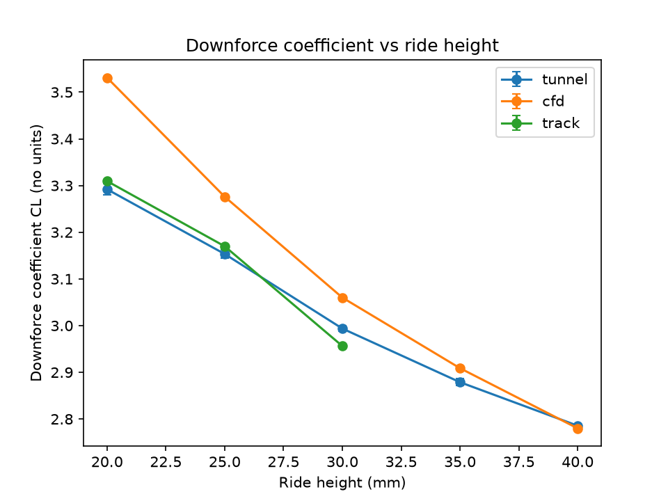
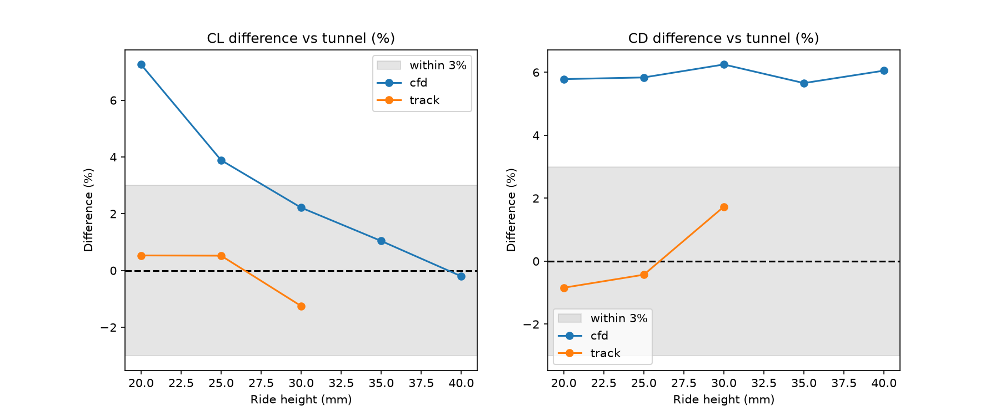

# Aero Correlation Checker

A small command-line tool that checks whether three sources of aerodynamic data agree with each other: the wind tunnel, CFD (computer simulation of airflow) and the real car on track. Raw forces cannot be compared directly, because the tunnel uses a 60% scale model at 50 m/s, CFD simulates a full-size car at 60 m/s, and the track car is full size at about 70 m/s. A bigger car or faster air gives a bigger force even when the aerodynamics are identical. So the tool converts every force into a coefficient, which does not depend on size or speed. It then lines the three sources up by ride height, flags where they disagree and suggests the likely reason.

## How to run it

```
source .venv/bin/activate
python make_data.py
python analyse.py
```

`make_data.py` writes the three data files into `data/`. `analyse.py` reads them and writes its results into `output/`. It takes three optional settings: `--data` (the input folder), `--out` (the output folder) and `--tolerance` (the largest gap, in percent, that still counts as agreement, 3.0 unless you change it).

To run the tests:

```
python -m pytest -q
```

## The input files

All three files have exactly the same columns:

| column | type | meaning |
|---|---|---|
| `run_id` | int | row number within the file, starting at 1 |
| `ride_height_mm` | int | ride height, one of 20, 25, 30, 35, 40 |
| `speed_ms` | float | air speed in m/s |
| `ref_area_m2` | float | reference area used for the coefficients |
| `downforce_n` | float | downforce in newtons |
| `drag_n` | float | drag in newtons |

One row means:

- `tunnel.csv`: one wind tunnel run of the 60% model at one ride height. Three repeats per height, so 15 rows.
- `cfd.csv`: one simulation of the full-size car at one ride height. 5 rows.
- `track.csv`: one averaged measurement from the real car at one ride height. 4 rows, because one height is missing.

## The outputs

`analyse.py` writes four files into `output/`:

- `summary.txt`: the data quality report, the gap to the tunnel at every ride height, and a verdict for each comparison. The same text is printed to the console.
- `results.db`: a small SQLite database. Every run is added to it, so repeated runs build a history.
- `coefficients.png`: the downforce coefficient of each source against ride height.
- `differences.png`: how far CFD and the track sit from the tunnel, in percent.

The two charts are shown below. These are copies kept in `docs/`, because `output/` is not committed to git.





## The four planted faults

The fake data has four faults planted in it. They are the four kinds of thing that go wrong in real correlation work.

| fault | what was planted | what catches it |
|---|---|---|
| A bad reading | Tunnel run 8 has 25% too much downforce. | The repeatability check. Its CL is too far from the median of the three repeats at 30 mm. |
| A setup mistake | Every CFD drag value is 6% too high. | The diagnosis. The same gap at every ride height is reported as a constant offset. |
| Weak ground-effect modelling | CFD downforce is too high, and worse the lower the car runs. | The diagnosis. A gap that grows as ride height falls is reported as a ground-effect problem. |
| Missing data | The track has no 35 mm row, and no downforce value at 40 mm. | The missing-value check drops the 40 mm row. The comparison then shows "no data" at both heights. |

## What I would add next

- Counting runs against the aerodynamic testing limit. Teams are only allowed a fixed number of tunnel runs and CFD simulations, so every run that has to be thrown away is a wasted one.
- Reading real telemetry instead of a CSV file.

All data is synthetic; this is a learning project.
